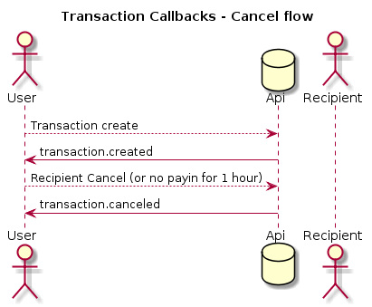

# TransferZero API Documentation

- [Introduction](#introduction)
- [API onboarding process](#api-onboarding-process)
- [Software Development Kits](#software-development-kits)
- [TransferZero API architecture](#transferzero-api-architecture)
  - [Authentication](#authentication)
  - [Status codes](#status-codes)
  - [Webhooks](#webhooks)
  - [Metadata](#metadata)
  - [External ID](#external-id)
  - [Senders](#senders)
  - [Recipients](#recipients)
  - [Transactions](#transactions)
  - [Balances](#balances)

## Introduction

The TransferZero API allows users to create transactions programmatically to send and receive money from various African countries. This documentation provides a tutorial for the most common flows of using the API.

There is also a more complete reference of the available API calls available at https://api.transferzero.com/documentation

## API onboarding process

To use our API please register and obtain valid API keys on the [TransferZero developer portal](https://developers.transferzero.com).

Initially the keys will only be valid to be used on our sandbox environment at https://api-sandbox.transferzero.com

Once development is finished against our API, please contact TransferZero where our representatives will validate your implementation and if successful allow access to the live environment.

> **WARNING**
>
> During this verification we will check that your implementation works as expected, and as a minimum supports the following functionalities:
>
> * Authenticate to our site
> * Create and re-use senders
> * Create and fund transactions
> * Check the status of transactions both via webhooks and manually
> * Handling and cancelling failed transactions

You can also check our [quick integration guide](quick-integration.md) that contains the major points in making sure your implementation will be approved. You can also check our [additional features guide](additional-features.md) for some of the other features we support and you might want to use, and also the [reference documentation](https://api.transferzero.com/documentation) which contains a reference of all of the available API endpoints we have.

## Software Development Kits

To facilitate easier integration with our API, we have SDKs available for the following languages:

- [Java 7](sdks/java7.md)
- [Java 8](sdks/java8.md)
- [Ruby](sdks/ruby.md)
- [Javascript](sdks/javascript.md)
- [PHP](sdks/php.md)
- [.NET (C# / VB.NET)](sdks/dotnet.md)

We encourage all users to make use of these SDKs as it will greatly ease the process of developing a successful integration with our API.

## TransferZero API architecture

### Authentication

Every API call needs to be authenticated. See the [authentication documentation](authentication.md) for more details on the authentication process.

### Status codes

Generally in our API there are two types of status codes used:

* A `200` or `201` status code means that the request was accepted, and there were no issues with it.
* A `422` status code is used whenever there was a validation error with the request. In case of validation errors, they are returned in the `errors` field, other errors are usually present in the `meta` field in the response.

### Webhooks

A *webhook* is a callback which enables our API to notify your system of new events concerning your transactions. Whenever objects in the TransferZero API change state, we can optionally send the changed details to a pre-registered webhook address. Webhooks can be created either using the [developer portal](https://developers.transferzero.com), or using the [TransferZero API](https://api.transferzero.com/documentation#webhooks).

Whenever possible we prefer using webhooks to listen on events (for example when a transaction has been paid out) instead of polling the status, and we expect implementations fully utilising webhooks.

Webhooks will always generate a `POST` request to the specified endpoint, and will also include the same authentication headers as described in the [authentication documentation](authentication.md), so their validity can be verified on the receiver end.

The structure of the body we send will always follow the following template:

```javascript
{
  "webhook": // the ID of the webhook
  "event": // the specific event
           // that was triggered
  "object": {
    // the full details of
    // the object on which
    // the event happened
  }
}
```

If the endpoint we have to call is behind a firewall please let us know so we can tell you the exact IP addresses that you need to whitelist. In case of a transmission error we will also try to send the webhook again five times before dropping the request.

There are examples showing how to parse a received webhook message using our SDKs:

- [Java 7 webhook example](https://github.com/transferzero/transferzero-sdk-java7/blob/master/example/src/main/java/co/transferzero/test/Application.java#L125)
- [Java 8 webhook example](https://github.com/transferzero/transferzero-sdk-java8/blob/master/example/src/main/java/co/transferzero/test/Application.java#L125)
- [Ruby webhook example](https://github.com/transferzero/transferzero-sdk-ruby/blob/master/example/client.rb#L180)
- [Javascript webhook example](https://github.com/transferzero/transferzero-sdk-javascript/blob/master/examples/examples.js#L186)
- [PHP webhook example](https://github.com/transferzero/transferzero-sdk-php/blob/master/examples/client.php#L219)
- [.NET (C# / VB.NET) webhook example](https://github.com/transferzero/transferzero-sdk-javascript/blob/master/examples/examples.js#L186)

The following are examples of some possible webhook flows and events. Please note this is not an exhaustive list however covers the majority of cases:

#### Transaction success


#### Transaction canceled



#### Transaction refunded


You can obtain an up-to-date list of available webhook events using the [Webhook Events endpoint](https://api.transferzero.com/documentation/#/Webhooks/get-webhook-events) of our API.

### Metadata

Most models in the TransferZero API allow storing any metadata, which will be returned when querying the object, including callouts from webhooks. This facility can be used to store any data on the models.

### External ID

An external ID can be included when Transactions are created, which are typically used for linking transactions to the models inside the API user's system. If the specified external ID already exists in our system the transaction will fail to validate, and the corresponding duplicate transaction will be returned along with an error.

For more information on External IDs, see the [Transaction flow documentation](transaction-flow.md#external-id)

### Senders

The senders model stores information about who sends the money for the transaction. Only senders that are KYC'd are allowed to pay in money.

If your site already does KYC on the senders, then let us know as we might waive the requirement to send us sender documents to ease the usage of our API. Otherwise you will have to send us documents for each sender which we will validate.

As with transactions, external IDs can also be included for senders when a transaction is created. If this ID already exists in our system, any details sent along with the external ID are used to update the sender.

You can read more on creating senders in the [Transaction flow documentation](transaction-flow.md).

### Recipients

The recipient model stores information about who receives money from a transaction, and whether the money has already been paid out or not. Any issues during the payout process are also stored against the recipient, therefore when checking for transaction issues one has to also subscribe for events on the recipients.

You can read more on recipients and how they work during transactions in the [Transaction flow documentation](transaction-flow.md).

### Transactions

The main model of the TransferZero API is the Transaction, which store the flow for sending money from one Sender in a specific currency, to one or multiple Recipients in another currency. You can read more on transactions in the [Transaction flow documentation](transaction-flow.md).

### Balances

By default when creating a transaction we will do both the collection of the money from the senders, and the payout to the recipients. If your site already does collection on the sender's behalf then please contact us, and we can set up an internal account with us.

Once we approve your request and set up your balance, you can use that balance to fund the payin part of the transaction. You can read more on funding transactions from your internal balance in the [Transaction flow documentation](transaction-flow.md).

If you have a balance with us you can use the `GET /v1/accounts` to get all or `GET /v1/accounts/XXX` endpoint to obtain a specific currency's balance with us (`XXX` is the currency you are interested in).

Please contact us to obtain our list of supported currency pairs for transactions.
