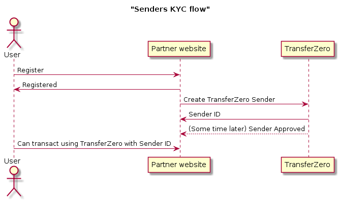

# The transaction flow

- [The transaction flow](#the-transaction-flow)
  - [Introduction](#introduction)
  - [Creating transactions](#creating-transactions)
    - [Input currency](#input-currency)
    - [Sender](#sender)
    - [Recipient](#recipient)
      - [Payout type](#payout-type)
      - [Requested amount and currency](#requested-amount-and-currency)
      - [Payout details](#payout-details)
        - [NGN::Bank](#ngnbank)
        - [NGN::Mobile](#ngnmobile)
        - [GHS::Bank](#ghsbank)
        - [GHS::Mobile](#ghsmobile)
        - [UGX::Mobile](#ugxmobile)
        - [TZS::Mobile](#tzsmobile)
        - [EUR::Bank](#eurbank)
        - [GBP::Bank](#gbpbank)
        - [MAD::Cash](#madcash)
        - [XOF::Mobile](#xofmobile)
        - [XOF::Cash](#xofcash)
    - [Metadata](#metadata)
    - [External ID](#external-id)
  - [Transaction object](#transaction-object)
    - [id](#id)
    - [state](#state)
    - [state_reason](#statereason)
    - [input_amount and input_currency](#inputamount-and-inputcurrency)
    - [sender](#sender)
    - [recipients](#recipients)
      - [id](#id-1)
      - [output_amount and output_currency](#outputamount-and-outputcurrency)
      - [state](#state-1)
      - [state_reason](#statereason-1)
      - [editable](#editable)
      - [may_cancel](#maycancel)
      - [payout_method.fields](#payoutmethodfields)
  - [Funding transactions](#funding-transactions)
  - [Checking the state of the transaction](#checking-the-state-of-the-transaction)
  - [Receiving error messages](#receiving-error-messages)
  - [Cancelling recipients and transactions](#cancelling-recipients-and-transactions)

## Introduction

Transactions are the main objects in the TransferZero API, so it's important to understand how to create and manage them. Transactions facilitate money movement from one Sender in a specific currency to one or multiple Recipients in another currency.

The main flow of a successful transaction flow is the following:

* Transaction is created linking the Sender to the Recipient(s) with the requested amounts.
* Once the sender is KYC'd and approved the transaction can be funded.
* Once the transaction is funded, we will initiate the payout to the recipient(s).
* After the recipient (or all recipients) has received the money, the transaction is finished.

Unfortunately not all transactions are successful. The main causes of issues are the following:

* Transactions are cancelled automatically if they are not funded within the first hour of creation.
* The recipient details might be wrong (for example the destination bank account number is invalid), or there are other issues blocking the successful payout. In these cases the transaction has to be cancelled.
* Once the transaction is cancelled, we will refund the money to the sender. Funds from account balances are always refunded automatically to the account balance. Funds from other types of payins might require manual processing however.

## Creating transactions

Transactions can be created by calling the `POST /v1/transactions` endpoint. The template of transaction requests is the following:

```javascript
{
   "transaction":{
      "input_currency": // currency to pay in,
      "sender":{
         // details of the sender
      },
      "recipients":[
         {
            "requested_amount": // the amount to pay out,
            "requested_currency": // the currency of the amount,
            "payout_method":{
               "type": // method of the payout,
               "details":{
                  // details of the recipient
               }
            }
         }
      ],
      "metadata": // optional metadata
      "external_id": // optional parameter for adding a custom ID to transactions
   }
}
```

Note that the `external_id` field is optional. Please see [external ID](#external-id) for further information.

A full example transaction creation request with sender creation from EUR to NGN would look like the following:

```json
{
  "transaction": {
    "input_currency": "EUR",
    "sender": {
      "country": "US",
      "phone_country": "US",
      "phone_number": "1234234234",
      "email": "test@example.com",
      "first_name": "Text",
      "last_name": "Example",
      "city": "City",
      "street": "Street",
      "postal_code": "12345",
      "birth_date": "1970-01-01",
      "documents": [ ],
      "ip": "127.0.0.1",
      "external_id": "76f69f5e-912f-43e5-bf3a-9081dbc476f4",
      "metadata": {
        "local_id": "SENDER-1234"
      }
    },
    "recipients": [
      {
        "requested_amount": "7040",
        "requested_currency": "NGN",
        "payout_method": {
          "type": "NGN::Bank",
          "details": {
            "first_name": "Name",
            "last_name": "Name",
            "bank_code": "058",
            "bank_account": "123456789",
            "bank_account_type": "10"
          }
        }
      }
    ],
    "metadata": {},
    "external_id": "806ec63a-a5a7-43cc-9d75-1ee74fbcc026"
  }
}
```

### Input currency

The input currency describes what currency the transaction will be paid in. For example if you wish to create an `EUR` to `NGN` transaction then input currency should be set to `EUR`.

### Sender

This section contains the details of the sender. The first time a specific sender is used the full details should be provided, example:

```javascript
{
  "country": "US",
  "phone_country": "US",
  "phone_number": "1234234234",
  "email": "test@example.com",
  "first_name": "Text",
  "last_name": "Example",
  "city": "City",
  "street": "Street",
  "postal_code": "12345",
  "birth_date": "1970-01-01",
  "documents": [ ],
  "ip": "127.0.0.1",
  "identification_number": "AB123456",
  "identification_type": "ID",
  "external_id": "76f69f5e-912f-43e5-bf3a-9081dbc476f4",
  "metadata": {}
}
```

When a sender is created you will receive a response which contains the sender's status. Possible states for a sender are:

* initial - When a sender is created and has not been through any KYC checking (cannot transact)
* verified - A sender has passed sanction list checks (cannot transact)
* approved - The sender has passed both KYC and sanction checks (**can** transact)
* banned - An admin has banned the sender (cannot transact)
* rejected - The sender has failed sanction list checks (cannot transact)
* disabled - A sender is put into this state as a result of a delete request via the API (cannot transact)

In order to transact with TransferZero we need to have an `approved` sender record. The flow for approving senders depend on whether KYC requirements are waived for your integration or not (See the notes section).

In case the KYC requirements are not waived then the typical flow for approval this will be the following:



In case the KYC requirements are waived then all created senders will be in the `approved` state immediately, and can be immediately used for transactions.

**ID and External ID:**

The `external_id` field is optional, allowing you to add a custom ID for the sender as with the external ID [available for transactions](#external-id). The ID/External ID can be included with the sender in four ways:

* Only an `id` is provided - we will search for the corresponding sender and use this reference.
* An `id` is provided along with additional fields - we will update the corresponding sender with the information contained as parameters if the id exists on our system. Otherwise an error will be returned if the `id` does not exist.
* Only an `external_id` is provided - we will search for the corresponding sender and use this reference.
* An `external_id` is provided along with additional fields - we will create a new sender with this reference. This process is subject to duplicate validation, and an error will be returned with the corresponding sender if a duplicate `external_id` is found to already exist on our system.\
An exception to this is if the `external_id` is provided along with additional fields **when a transaction is being created**. In this case, any details sent along with the external ID are used to update the sender.

Please note that sending both an `id` and `external_id` at once is invalid and will result in an error.

If a sender has been assigned an `external_id`, this value can be used to find senders using the `GET v1/senders` endpoint, with `external_id` parameter included as a string. For example: `GET v1/senders?external_id=76f69f5e`

**Notes:**

* The sender's phone number is composed of two parts, the `phone_country` (in ISO 2-letter format), and the `phone_number`. The phone number should be specified without the international prefix.
* The `documents` should contain all documents necessary to KYC the sender.
  * If you already do KYC on your system, then please contact us and we can waive this requirement from you. In this case you should send us an empty list of documents: `"documents": [ ]` in the request. All of the senders you create in the system will be immediately set to the `approved` state and you won't need to wait for them to get approved.
  * If when creating senders or transactions you get the following error in the response: `"errors":{"documents":[{"error":"blank"}]}` it means that KYC requirements are not yet waived for your account. If we already approved your KYC process and so they should be, then please contact us so we can rectify the issue and update your account accordingly.
  * In case you don't do KYC on your site, then you will need to send us documents that we can use to verify the sender's identity, for more details on this please see the [API reference documentation](https://api.transferzero.com/documentation#documents).
* If you do not wish to use Cashplus or MAD:Cash as corridor, then we can enable WTR2 rules for you to identify the `sender`.
* If WTR2 is enabled, all you need in order to identify a `sender` is to provide one of the set of documentation fields defined below.
* Identification number: Identification number of document used with a 4-character minimum length.
* Identification type:
  - `DL`: Driving License
  - `PP`: International Passport
  - `ID`: National ID
  - `OT`: Other
* There are three different set of fields:
  - 'identification_number' and 'identification_type'
  - 'city', 'street', 'postal_code'
  - 'birth_date'
* The sender only needs to contain one of the set of fields from above.
  E.g.: if the sender contains the birth date, then it does not need to contain anything from the first or the second set of the fields.
* The `metadata` field can store any information you wish to store with the sender. If you don't wish to store anything simply specify `{}`.

Once a sender is created and is used, the next time you MUST only send the ID of the sender. This is so we can match the same sender across multiple transactions for KYC and audit purposes. In this case the sender inside the transaction creation call would look like the following:

```json
{
  "transaction": {
    "sender": {
      "id": "b6648ba3-1c7b-4f59-8580-684899c84a07"
    },
    (...)
  }
}
```

> **WARNING**
>
> For your application to get approved you MUST support reusing the sender ID for the same sender across transactions. If the sender's details change in your system then you can use the `PATCH /v1/senders/<sender_id>` endpoint to update the sender details you store in our system to keep them up-to-date.

> **NOTE**
>
> Although Senders can also be created separately using the sender creation API call, in order to decrease the amount of distinct calls to the system we prefer if new senders are created with the first transaction they appear in.

### Recipient

The recipient describes the amount, the currency and the destination where the money should be sent. Although transactions can support paying out multiple recipients, usually one is provided.

The template for the recipient is the following:

```javascript
{
  "requested_amount": // the amount to pay out,
  "requested_currency": // the currency of the amount,
  "payout_method":{
      "type": // method of the payout,
      "details":{
        // details of the recipient
      }
  }
}
```

#### Payout type

The payout type contains where the money should be sent to and to what currency. You can find a complete list of supported types at the [API reference documentation](https://api.transferzero.com/documentation#transactions).

Commonly used payout types are:

* `NGN::Bank`: for Nigerian bank account payments
* `NGN::Mobile`: for Nigerian mobile money payments
* `GHS::Bank`: for Ghanaian bank account payments
* `GHS::Mobile`: for Ghanaian mobile money payments
* `UGX::Mobile`: for Ugandan mobile money payments
* `TZS::Mobile`: for Tanzanian mobile money payments
* `XOF::Mobile`: for Senegalese mobile money payments
* `XOF::Cash`: for Senegalese cash payments
* `MAD::Cash`: for Moroccan cash remittance payments
* `EUR::Bank`: for IBAN bank transfers in EUR
* `GBP::Bank`: for IBAN bank transfers in GBP

Unless you hold an internal balance with us, the input currency and payout currency cannot be the same. If you wish to do same-currency transactions please contact our team for further details.

#### Requested amount and currency

This will be the amount that you would wish to pay to the recipient. The value here can be in any particular supported currency, usually either the input or the output one.

In the transaction create response we will return how much this is in the input currency, and will also return how much we would pay out to the recipient in the output currency.

A few common examples:

* Input currency is `EUR` Payout type is `NGN::Bank`. Requested amount is `100 EUR`.

  In this case we will calculate how much `100 EUR` is in `NGN` (as of writing around 44000), and will return: input amount is `100 EUR` and output amount is `44000 NGN`

* Input currency is `USD` Payout type is `NGN::Bank`. Requested amount is `10000 NGN`.

  In this case we will calculate how much `10000 NGN` is in `USD` (as of writing around 25), and will return: input amount is `25 USD` and output amount is `10000 NGN`

* Input currency is `NGN` Payout type is `NGN::Bank`. Requested amount is `10000 NGN`.

  In this case we will simply pay out `10000 NGN` to the recipient. Note that same input and output currencies are only supported if you hold an internal balance with us. If you're interested in that please contact our team.

* Input currency is `USD` Payout type is `NGN::Bank`. Requested amount is `100 EUR`.

  Although the requested currency is neither the input nor the output one, we will calculate how much `100 EUR` is in `USD` and in `NGN` and will return those values in the input and output amounts. We will afterwards do the currency exchange directly, and will not involve the requested currency at all.

The requested amount is rounded to a specific number of decimal places and this depends on the currency. The decimal place information can be obtained from our currencies API endpoint - [/info/currencies/out](http://api.transferzero.com/documentation/#/Currency%20Info/info-currencies-out).

For some currencies however, we are not able to pay out subunits and they will always be rounded up.
These currencies are KES, TZS, UGX and NGN.

The current list of currencies and associated decimal places is below -
* AED - 2
* CAD - 2
* CHF - 2
* CNY - 2
* EUR - 2
* GHS - 2
* GBP - 2
* JPY - 0
* KES - 0
* KRW - 0
* MAD - 2
* NGN - 0
* TZS - 0
* UGX - 0
* USD - 2
* XOF - 0
* ZAR - 2

#### Payout details

The payout details depend on the chosen payout type. You can find example calls at the [API reference documentation](https://api.transferzero.com/documentation#transactions).

Examples for the most commonly used payout providers:

##### NGN::Bank

```javascript
"details": {
  "first_name": "First",
  "last_name": "Last",
  "bank_code": "058",
  "bank_account": "123456789",
  "bank_account_type": "10"
    // 10 for saving
    // 20 for current accounts
}
```

The valid `bank_code` values are:

```
Access Bank: 044
Diamond Bank: 063
EcoBank: 050
FCMB Bank: 214
Fidelity Bank: 070
First Bank of Nigeria: 011
Guaranty Trust Bank : 058
Heritage Bank: 030
Jaiz Bank: 301
Keystone: 082
Polaris Bank: 076
Stanbic IBTC Bank: 039
Standard Chartered Bank PLC: 068
Sterling bank: 232
Suntrust Bank: 100
Union Bank: 032
United Bank for Africa: 033
Unity Bank: 215
Wema Bank: 035
Zenith International: 057
```

##### NGN::Mobile

```javascript
"details": {
  "first_name": "First",
  "last_name": "Last",
  "phone_number": "7087661234"
    // local Nigerian format
}
```

##### GHS::Bank

```javascript
"details": {
  "first_name": "First",
  "last_name": "Last",
  "bank_code": "030100",
  "bank_account": "123456789"
}
```

The current banks supported and their `bank_codes` values are:
```
Access Bank: 280100
Barclays Bank: 030100
GCB Bank: 040100
Ecobank: 130100
First National Bank: 330100
Heritage Bank: 370100
Prudential Bank: 180100
Stanbic Bank: 190100
Standard Chartered Bank: 020100
United Bank for Africa: 060100
Zenith Bank: 120100
Fidelity Bank: 240100
```
##### GHS::Mobile

```javascript
"details": {
  "first_name": "First",
  "last_name": "Last",
  "phone_number": "302123456"
    // local Ghanaian format
}
```

##### UGX::Mobile

```javascript
"details": {
  "first_name": "First",
  "last_name": "Last",
  "phone_number": "414123456"
    // local Ugandan format
}
```

##### TZS::Mobile

```javascript
"details": {
  "first_name": "First",
  "last_name": "Last",
  "phone_number": "221231234"
    // local Tanzanian format
}
```

##### EUR::Bank

```javascript
"details": {
  "first_name": "First",
  "last_name": "Last",
  "bank_name": "Deutsche Bank",
  "iban": "DE89370400440532013000",
  "bic": "DEUTDEBBXXX" // Optional
}
```

##### GBP::Bank

```javascript
"details": {
  "first_name": "First",
  "last_name": "Last",
  "bank_name": "Lloyds Bank",
  "iban": "GB29LOYD60161331926819",
  "bic": "LOYDGB2L" // Optional
}
```

##### MAD::Cash

```javascript
"details": {
  "first_name": "First",
  "last_name": "Last",
  "phone_number": "212537718685"
    // Mandatory; International format preferred
  "sender_identity_card_type" => "O",
    // Mandatory; Values: "O": Other, "PP": Passport, "NI": National ID
  "sender_identity_card_id" => 'AB12345678',
    // Mandatory
  "sender_city_of_birth" => "London",
    // Mandatory
  "sender_country_of_birth" => "GB",
    // Mandatory; ISO 2-letter format
  "sender_gender" => "M",
    // Mandatory; Values: "M": Male, "F": Female
  "reason" => "Remittance payment",
    // Optional; Default value is 'Remittance payment'
  "identity_card_type" => "NI",
    // Optional; Values: "PP": Passport, "NI": National ID
  "identity_card_id" => 'AB12345678'
    // Optional
}
```

Please note when sending `MAD::Cash` payments you should subscribe to the `recipient.pending` webhook, as that will broadcast the payment reference ID the customer need to use to obtain the funds. Example webhook response excerpt:

```javascript
{
   (...)
   "state":"pending",
   "metadata": {
     "payment_reference":"9M5GJRJUBCY"
   },
   (...)
}
```

The payment reference can also be provided in the recipient details hash optionally for `MAD::Cash` in which case it will be used instead of the one we generate. The field you have to provide in the hash is called `reference`. If you wish to use this functionality, please contact us for more details.

##### XOF::Cash

```javascript
"details": {
  "first_name": "First",
  "last_name": "Last",
  "phone_number": "774044436" // local Senegalese format
}
```

Please note when sending `XOF::Cash` payments you should subscribe to the `recipient.pending` webhook, as that will broadcast the payment reference ID the customer need to use to obtain the funds. Example webhook response excerpt:

```javascript
{
   (...)
   "state":"pending",
   "metadata": {
     "payment_reference":"9M5GJRJUBCY"
   },
   (...)
}
```

##### XOF::Mobile

```javascript
"details": {
  "first_name": "First",
  "last_name": "Last",
  "mobile_provider": "orange", // "orange" or "tigo"
  "phone_number": "774044436" // local Senegalese format
}
```

The valid `mobile_provider` values are:

```
orange
tigo
```

### Metadata

Similarly to the sender, you can store any kind of information to the transaction. If you don't wish to store anything leave the field empty: `{}`

### External ID

External ID is an optional field that allows you to add a custom ID for the transaction, should you wish to link it to a transaction within your own local system. This internal reference value will be displayed in your transaction reports.

If an `external_id` is present when transactions are created, we will validate whether it is a duplicate in our system or not. This functionality provides a safeguard against transactions being assigned the same `external_id`. If a duplicate is found, an error will be returned along with the corresponding transaction.

Once an `external_id` has been set, it can be used to find transactions using the `GET v1/transactions` endpoint, with `external_id` parameter included as a string. For example: `GET v1/transactions?external_id=806ec63a`

## Transaction object

Once the transaction is created successfully, you will receive back a transaction object. This object will always contain all details about the sender, the transaction and the recipients.

In case the transaction couldn't be created, you will get back a `422` response and inside the body you should find all of the vaildation messages which should be fixed.

A transaction object looks like the following:

```javascript
{
  "object": {
    "id": "5280d11f-0ed3-4a60-ab07-29fdb058e4c4",
    "metadata": {
    },
    "state": "approved",
    "input_amount": 1000.00,
    "input_currency": "GBP",
    "sender": {
      "id": "fdee3b02-81ad-409d-9f34-2b0dd5c39e8f",
      "type": "person",
      "state": "approved",
      "state_reason": null,
      "country": "UG",
      "street": "fake street",
      "postal_code": "fak3 one",
      "city": "London",
      "phone_country": "UG",
      "phone_number": "752403639",
      "email": "example@home.org",
      "ip": "127.0.0.1",
      "external_id": "76f69f5e-912f-43e5-bf3a-9081dbc476f4",
      "first_name": "Peter",
      "last_name": "Smith",
      "birth_date": "1987-08-08",
      "metadata": {
        "my": "data"
      },
      "providers": {
      }
    },
    "payin_methods": [

    ],
    "paid_amount": 0.0,
    "due_amount": 1000.00,
    "recipients": [
      {
        "id": "31288256-ec72-4a0a-bab7-06fb3a6cc8dd",
        "transaction_id": "5280d11f-0ed3-4a60-ab07-29fdb058e4c4",
        "created_at": "2017-08-08T13:19:32.855Z",
        "input_usd_amount": 772.5,
        "state": "initial",
        "transaction_state": "initial",
        "editable": true,
        "may_cancel": true,
        "requested_amount": 750.0,
        "requested_currency": "USD",
        "input_amount": 1000.00,
        "input_currency": "EUR",
        "output_amount": 294750.0,
        "output_currency": "NGN",
        "payout_method": {
          "id": "e7e6ca2e-1b38-4d55-991c-d6933c2f6043",
          "type": "NGN::Bank",
          "details": {
            "first_name": "Johnny",
            "last_name": "English",
            "bank_code": "050",
            "bank_account": "11039382982833",
            "bank_account_type": "20"
          },
          "metadata": {
          },
          "provider": "interswitch",
          "fields": {
            "email": {
              "type": "input",
              "validations": {
                "format": "\\A((\\w+([\\-+.]\\w+)*@[a-zA-Z0-9]+([\\-\\.][a-zA-Z0-9]+)*)*){3,320}\\z"
              }
            },
            "first_name": {
              "type": "input",
              "validations": {
                "presence": true
              }
            },
            "last_name": {
              "type": "input",
              "validations": {
                "presence": true
              }
            },
            "bank_code": {
              "type": "select",
              "options": {
                "063": "Diamond Bank",
                "050": "EcoBank",
                "214": "FCMB Bank",
                "070": "Fidelity Bank",
                "011": "First Bank of Nigeria",
                "058": "Guaranty Trust Bank ",
                "030": "Heritage Bank",
                "301": "Jaiz Bank",
                "082": "Keystone ",
                "014": "Mainstreet ",
                "076": "Polaris Bank",
                "039": "Stanbic IBTC Bank ",
                "232": "Sterling bank",
                "032": "Union Bank",
                "033": "United Bank for Africa ",
                "215": "Unity Bank",
                "035": "Wema Bank",
                "057": "Zenith International "
              },
              "validations": {
                "presence": true,
                "inclusion": {
                  "in": {
                    "063": "Diamond Bank",
                    "050": "EcoBank",
                    "214": "FCMB Bank",
                    "070": "Fidelity Bank",
                    "011": "First Bank of Nigeria",
                    "058": "Guaranty Trust Bank ",
                    "030": "Heritage Bank",
                    "301": "Jaiz Bank",
                    "082": "Keystone ",
                    "014": "Mainstreet ",
                    "076": "Polaris Bank",
                    "039": "Stanbic IBTC Bank ",
                    "232": "Sterling bank",
                    "032": "Union Bank",
                    "033": "United Bank for Africa ",
                    "215": "Unity Bank",
                    "035": "Wema Bank",
                    "057": "Zenith International "
                  }
                }
              }
            },
            "bank_account": {
              "type": "input",
              "validations": {
                "presence": true
              }
            },
            "bank_account_type": {
              "type": "select",
              "options": {
                "20": "Current",
                "10": "Savings"
              },
              "validations": {
                "presence": true,
                "inclusion": {
                  "in": {
                    "20": "Current",
                    "10": "Savings"
                  }
                }
              }
            }
          }
        },
        "metadata": {
        }
      }
    ],
    "created_at": "2017-08-08 13:19:32 UTC",
    "expires_at": "2017-08-08T14:19:32.855Z",
    "external_id": "806ec63a-a5a7-43cc-9d75-1ee74fbcc026"
  }
}
```

As shown, the response contains a lot of information, the most important are the following:

### id

The ID of the transaction

### state

The state of the transaction, which can be one of the following:

* `initial`: Transaction is created, but not yet ready to receive payments (waiting for Sender to be KYC'd and approved).
* `approved`: Transaction is created and the sender is approved. Payment can be received
* `pending`: Transaction has received a payin, and it's waiting for the funds to clear.
* `received`: Transaction has received the correct payin amount and will start processing the payouts.
* `mispaid`: Transaction received funds, but not the requested amount. The transaction will be resized, and will start payout based on the received funds.
* `manual`: Some of the payments to the recipients have run into issues. Please check the recipient statuses for more information.
* `paid`: Transaction has received correct payins and has performed payouts to all recipients. No further steps required
* `canceled`: The transaction has been cancelled. Transactions are cancelled automatically after one hour if there was no funds received. Once transactions are funded they can be cancelled by the API user unless the recipients have been paid out.
* `refunded`: The transaction has been cancelled after it has been funded, but the funds have been returned now to the sender either partially or fully.
* `exception`: An exception happened during the processing of the transaction. Please contact TransferZero

### state_reason

If there is an error with the transaction you can find the error message in this field.

### input_amount and input_currency

This is the amount that has to be collected from the sender, or funded from the internal balance.

### sender

The full details of the sender. If this is a new sender, please make a note of the `id` field, as that MUST be used in subsequent transaction creation calls that are from the same sender. If an `external_id` is present on the sender, this will also be included. Please see [Sender](#sender) for more details on how `external_id` functions.

### recipients

The following fields are useful on the recipients:

#### id

The id of the recipient

#### output_amount and output_currency

The amount of money the recipient will receive if the transaction is funded.

#### state

The state of the recipient. Can be one of the following:

* `initial`: We haven't initiated the payout yet, you can still cancel the transaction
* `pending`: Payout has been initiated and we're waiting from a response from the provider. The transaction cannot be cancelled
* `success`: Payout is done, and the recipient has been paid.
* `error`: There was an error from the provider, you can find more details in the `state_reason` attribute. We will usually retry the transaction at a later date. You can either wait, edit the recipient or cancel the transaction.
* `refunded`: You asked us to cancel the transaction and we refunded the money.
* `manual`: There were too many errors on this transaction, and we stopped retrying. Please edit the recipient, contact us or cancel the transaction.
* `stuck`: We didn't receive a response from the provider in time, and we don't know whether it has been paid our not. Please contact us for further details.
* `overpaid`: The recipient was paid out more than was requested (not applicable for most of the payout providers)
* `canceled`: The transaction has been cancelled, and we will refund the money soon
* `exception`: Some exception has happened; please contact TransferZero

#### state_reason

If there is a specific error for the recipient, you can find a description of the error here.

#### editable

Describes whether the recipient can still be edited or not. If it's editable, and the error message describes thet the account number or phone number was invalid, the recipient can be edited to contain the approriate values. Once the recipient is updated we will retry the payouts with the new details.

You can find more details on how to update recipients inside the [API reference documentation](https://api.transferzero.com/documentation#updating-a-recipient).

#### may_cancel

Shows whether the payout to the recipient can be cancelled at this state or not.

#### payout_method.fields

In case there were validation errors, you can find all of the fields and their valid values for the specified payout method. This can also include the available bank codes as well for bank payout providers.

#### external_id

The external ID of a transaction, if present.

## Funding transactions

By default, when creating a transaction we will collect the money from the sender. For more information on how to handle some collections, please visit [Collections](additional-features.md#collections-from-senders). You can also check the [API reference documentation](https://api.transferzero.com/documentation#fetching-possible-payin-methods
)

However, if your site already does collection on the sender's behalf then please contact us and we can set you up with an internal account with us.

Once you have an internal account, you can use that as well to fund transactions.

Funding transactions can be done using the `POST /v1/accounts/debits` endpoint, with the following body:

```json
{
  "to_id": "5f44026b-7904-4c30-87d6-f8972d790ded",
  "to_type": "Transaction"
}
```
You can also supply the `currency` and `amount` parameters, in which case we'll verify if they match the amount on the transaction and only fund it if they do
```json
{
  "currency": "NGN",
  "amount": "2000.0",
  "to_id": "5f44026b-7904-4c30-87d6-f8972d790ded",
  "to_type": "Transaction"
}
```

To successfully fund a transaction:

* The `to_id` is the `id` of the transaction
* You need to have enough balance of the appropriate currency inside your wallet.

If you choose to include the optional currency and/or amount params:
* The `currency` needs to be the same as the `input_currency` on the transaction.
* The `amount` has to be the same as the `input_amount` on the transaction

Once the transaction is funded, we will immediately start trying to pay out the recipient(s).

## Checking the state of the transaction

To manually check the state of the transaction, use the `GET /v1/transactions/ID` endpoint, where the `ID` is the id of the transaction. Transactions can also be retrieved using the `external_id`, [as documented here](#external-id).

However to get real-time information on when a transaction's state changes please create webhooks for transaction state changes using the developer portal, or the API, where we will send a response every time the transaction's state is changed.

> **WARNING**
>
> For your application to get approved it MUST use primarily the webhook functionality to determine the state of the transaction. Using the `GET` endpoint should only be done occasionally as a fall-back mechanism.

## Receiving error messages

Because payouts happen on the recipient level inside our system, any kind of issues with the payouts will appear on the recipient. To get real-time information on issues with payouts, please create webhooks for transaction and recipient state changes using the developer portal, or the API, where we will send a response every time the recipient's state changes to error.

The error message can be found inside the `state_reason` field on the recipient.

Note that as the errors are sent on the recipient, you will receive a recipient object in the webhook and not a full transaction. You can find the transaction id inside the `transaction_id` property of the recipient.

For example, on an error you will receive a webhook like this:

```
{
  "webhook": "fd599451-4f3c-4045-91e1-d68ed12ffb75",
  "event": "recipient.error",
  "object": {
    "created_at": "2018-05-28 08:06:13 UTC",
    "editable": true,
    "id": "f0c2f4ea-96cd-4270-b688-48af937fc53e",
    "input_usd_amount": 30.98,
    "may_cancel": true,
    "metadata": {},
    "state": "error",
    "state_reason": "Stolen card. Please contact account holder. This transaction is not possible. Please cancel.",
    "transaction_id": "94581e7a-a35a-430f-be0b-c8269a8acf4c",
    "transaction_state": "received",
    "payout_method": {
      "id": "f2cce765-abb0-4b56-96bb-623cd0f78f9c",
      "type": "NGN::Bank",
      "details": {
        "bank_code": "060",
        "last_name": "Test",
        "first_name": "Bank",
        "bank_account": "123345678",
        "bank_account_type": "20"
      },
      "metadata": {},
      "provider": "interswitch",
    },
    "requested_amount": 10874.0,
    "requested_currency": "NGN",
    "input_amount": 10874.0,
    "input_currency": "NGN",
    "output_amount": 10874.0,
    "output_currency": "NGN",
    "external_id": "806ec63a-a5a7-43cc-9d75-1ee74fbcc026"
  }
}
```

> **WARNING**
>
> For your application to get approved, it MUST support obtaining the error message from the recipient. It MUST also primarily use the webhook functionality to be notified of any errors, and only fall-back to using `GET` calls against the transaction occasionally.

## Cancelling recipients and transactions

In case there are errors with the payout and you wish to cancel it, you can do so by calling the `DELETE /v1/recipients/ID` endpoint, where `ID` is the id of the recipient (and NOT the transaction). If the recipient can be cancelled, this request, once processed, will cancel it. If the transaction was funded from an internal balance, it will then also be refunded.

Note: cancelling is only available if the `may_cancel` field is on the recipient true.

> **WARNING**
>
> For your application to get approved it MUST support the cancellation of recipients.

You can also enable the `auto_refund` trait on the transaction, this will mean your transactions will automatically be cancelled and refunded if they can't be paid out. For more information, please check the [auto cancellation](additional-features.md#auto-cancellation-and-refund-of-transactions) documentation.
